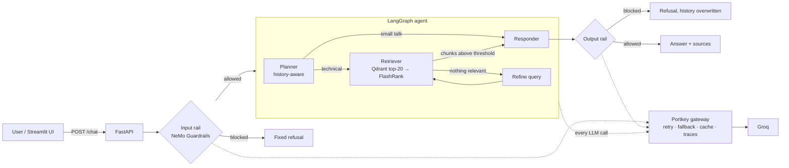

# Multi-Agent RAG Platform

An agentic Retrieval-Augmented Generation system that answers technical questions from a document corpus deliberately mixed with irrelevant "noisy" documents. A LangGraph agent plans each query, retrieves from Qdrant, filters noise with a cross-encoder re-ranker, and answers only from the retrieved evidence. Guardrails sit around the agent, an LLM gateway sits under it, and an evaluation pipeline measures it.

**Stack:** LangGraph · Groq (`gpt-oss-120b`) · Portkey AI Gateway · NeMo Guardrails · Qdrant · FastEmbed · FlashRank · DeepEval · FastAPI · Streamlit

---

## Why this project

Most RAG demos index a clean corpus. Real knowledge bases are not clean. This corpus has **6 relevant documents** (Kubernetes Jobs/CronJobs, autoscaling, cluster architecture, Databricks job tooling) buried among **~50 unrelated computer-science papers**, about 7,700 chunks in total. The system has to find the right passages and reject lookalikes, without being told which documents are which.

## Architecture



### Request flow

1. **Input rail.** NeMo Guardrails self-check blocks harmful requests, jailbreaks, prompt injection and off-topic questions before any retrieval or generation runs. A blocked request never enters conversation memory.
2. **Planner.** Reads the full conversation and returns a structured `Plan` (Pydantic): whether retrieval is needed, plus a standalone search query with pronouns resolved. For example, "how do I suspend *it*?" becomes a query about CronJobs.
3. **Retriever.** Embeds the query with `bge-small-en-v1.5` and pulls the top 20 candidates from Qdrant. The **FlashRank cross-encoder** (`ms-marco-MiniLM-L-12-v2`) then re-scores each candidate against the query, and only chunks above `RERANK_THRESHOLD` survive, up to 5. This is the step that separates true data from noise.
4. **Refine loop.** If nothing survives, the LLM rewrites the query and the graph retrieves again, bounded by `MAX_RETRIEVAL_ATTEMPTS` so the cycle always terminates.
5. **Responder.** Answers only from the surviving chunks, cites `[source, page]`, and says it doesn't know when the context lacks the answer.
6. **Output rail.** Checks the answer for leaked instructions, secrets or harmful content. If it blocks, the stored answer in the LangGraph checkpoint is replaced by message ID, so blocked content cannot leak into later turns.

### LLM gateway (Portkey)

Every LLM call (planner, refiner, responder, both guardrails, and the eval judge) goes through Portkey using an OpenAI-compatible client. The provider key lives in Portkey, not in the app. The saved gateway config provides:

- **Retries** on `429` and `5xx` only (a `400` is not retried)
- **Fallback** from `gpt-oss-120b` to `gpt-oss-20b`
- **30 s timeout** per request
- **Simple response cache** (1 hour)
- **Tracing:** every request is tagged with a `trace_id` and `_user` (the thread ID), so one chat turn's calls can be inspected together.

## Evaluation

A two-phase pipeline in [`evals/`](evals/) scores the system against a hand-verified golden set of **28 cases**: 20 answerable, 3 unanswerable, 3 that should be blocked, and 2 small talk. Expected answers were checked against the source documents.

- **Phase 1** (`collect.py`) runs each case through the real guardrails and agent, and saves the answer, retrieved chunks, sources and latency.
- **Phase 2** (`score.py`) computes the metrics and exits non-zero if any threshold fails, so it can gate a CI deploy.

| Metric | Type | What it measures |
|---|---|---|
| Noise ratio | deterministic | share of retrieved chunks that came from `noisy_data/` |
| Source hit rate | deterministic | did retrieval return the document that holds the answer? |
| Routing accuracy | deterministic | correct path taken: block, small talk, or retrieve |
| Abstain rate | deterministic | "I don't know" on unanswerable questions |
| Faithfulness, answer relevancy, context precision, context recall | LLM judge (DeepEval) | hallucination, focus and retrieval quality |

The judge runs through the same Portkey gateway, returns JSON-mode structured output, and backs off automatically on rate limits.

### Baseline results (28 cases)

| Metric | Result | Target |
|---|---|---|
| **Noise ratio** | **0.0**: no noisy chunk reached the LLM on any answerable query | ≤ 0.2 |
| **Source hit rate** | **0.95** | ≥ 0.8 |
| Routing accuracy | 0.893 | ≥ 0.9 |
| Abstain rate | 0.333 | ≥ 0.8 |
| p50 end-to-end latency | 3.33 s (including both guardrail checks) | — |

The baseline run found a real bug. The planner treated non-Kubernetes technical questions (Databricks, AWS pricing) as small talk, and the small-talk path then answered from the model's own knowledge without grounding. The planner and small-talk prompts have since been tightened so that any factual question is retrieved. Re-running the evals on the fixed planner, and completing the LLM-judge metrics (which are limited by Groq free-tier throughput), are the next steps.

## Project structure

```
├── api/                 FastAPI app: /chat, /health, request/response schemas
├── config/settings.py   Typed settings (pydantic-settings) loaded from .env
├── evals/               Golden set, collector, scorer, gateway-backed DeepEval judge
├── guardrails/config/   NeMo Guardrails: rails config, policy prompts, refusal message
├── ingestion/           Multi-format loader, chunker, ingestion pipeline
├── rag/                 LangGraph state, nodes (planner/retriever/refine/responder), graph
├── services/            LLM gateway client, embeddings, Qdrant, re-ranker, guardrails
├── ui/app.py            Streamlit chat UI
└── chat_cli.py          Terminal chat for quick testing
```

## Ingestion

`python -m ingestion.run_ingestion` walks `DATA/` recursively and supports **PDF, DOCX, PPTX, HTML and TXT**. Each format has its own reader, registered in a lookup table.

- **Chunking:** recursive splitting at 800 characters with 150 characters of overlap. Paragraph breaks are kept, and scraps under 50 characters are dropped.
- **Metadata:** each chunk keeps `source`, `category` (`true_data` / `noisy_data`), `format`, `page` and `chunk_index`. The category is used only for evaluation, never for filtering retrieval.
- **Idempotent upserts:** point IDs are `uuid5(source:page:chunk_index)`, so re-running ingestion overwrites chunks instead of duplicating them.
- **Fault tolerance:** a corrupt file is logged and skipped rather than stopping the run.

## Getting started

### Prerequisites

- Python 3.11
- A [Qdrant Cloud](https://cloud.qdrant.io) cluster (the free tier works)
- A [Groq](https://console.groq.com) API key
- A [Portkey](https://app.portkey.ai) account with:
  - a Groq provider added in **Model Catalog**
  - a saved **Config** like the one below

```json
{
  "strategy": { "mode": "fallback" },
  "retry": { "attempts": 3, "on_status_codes": [429, 500, 502, 503, 504] },
  "request_timeout": 30000,
  "cache": { "mode": "simple", "max_age": 3600 },
  "targets": [
    { "provider": "@your-groq-provider" },
    { "provider": "@your-groq-provider", "override_params": { "model": "openai/gpt-oss-20b" } }
  ]
}
```

### Setup

```bash
git clone git@github.com:kashyap03042003/Multi-Agent-Rag-Platform.git
cd Multi-Agent-Rag-Platform
conda create -n agent python=3.11 -y && conda activate agent
pip install -r requirements.txt
cp .env.example .env        # then fill in your keys and PORTKEY_CONFIG_ID
```

Put your documents in `DATA/`. Relevant documents go in `DATA/true_data/`, and distractors (optional) go in `DATA/noisy_data/`. The dataset itself is not included in this repository.

### Run

```bash
python -m ingestion.run_ingestion                     # index DATA/ into Qdrant
uvicorn api.main:app --reload --port 8000             # API; Swagger UI at http://localhost:8000/docs
streamlit run ui/app.py                               # UI at http://localhost:8501
```

### Evaluate

```bash
python -m evals.collect     # Phase 1: run the golden set through the system
python -m evals.score       # Phase 2: score the latest run; exits 1 if any threshold fails
```

## Configuration

All settings live in `.env` (see [`.env.example`](.env.example)). The retrieval knobs worth tuning:

| Variable | Default | Effect |
|---|---|---|
| `RERANK_THRESHOLD` | 0.3 | Minimum cross-encoder score for a chunk to reach the LLM. Raise it to cut noise; lower it to improve recall. |
| `RETRIEVE_TOP_K` | 20 | Number of vector-search candidates given to the re-ranker |
| `RERANK_TOP_N` | 5 | Maximum number of chunks kept as context |
| `MAX_RETRIEVAL_ATTEMPTS` | 2 | Upper bound on the refine-and-retrieve loop |

## Design decisions

- **Guardrails wrap the graph instead of generating replies.** NeMo runs with `options={"rails": [...]}`, so it only *checks* messages, and LangGraph stays in control of retrieval and answering.
- **Blocking LLM code runs in sync endpoints.** FastAPI runs `def` endpoints in a thread pool, so one slow LLM call doesn't block the event loop.
- **Models are warmed up at startup.** The embedder, re-ranker and guardrails load in the FastAPI `lifespan`, so the first user doesn't pay the cold-start cost.
- **Errors are generic to clients and detailed in logs.** A failed request returns `500` with a generic message; the full stack trace goes only to the server log.
- **Two-phase evals.** Collecting answers is slow and costs tokens. Saving the results lets you re-score or add metrics without running the system again.

## Roadmap

- [ ] Re-run the evals on the fixed planner and complete the LLM-judge metrics
- [ ] Run the guardrails on a small, fast model to cut latency and cost
- [ ] Persistent conversation memory with a Postgres LangGraph checkpointer
- [ ] Redis semantic cache with a tunable similarity threshold
- [ ] Event-driven ingestion (S3 upload → queue → ingestion worker)
- [ ] Split into microservices (API, UI, ingestion) with Docker
- [ ] AWS deployment (ECS/App Runner, RDS, ElastiCache, Secrets Manager) provisioned with Terraform
- [ ] CI pipeline that uses `evals.score` as a quality gate
